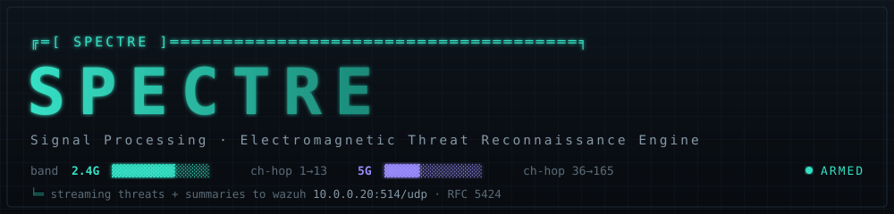

<br/>

<div align="center">



<br/>
<br/>

# SPECTRE

**A wireless intrusion-detection sensor. Two radios watch the air. Nothing gets on quietly.**

<br/>

[](#-what-it-does)

<br/>

[](#)
[](LICENSE)
[](sensor/)
[](sensor/)
[](web/)
[](web/)
[](sensor/spectre/store.py)
[](docs/wazuh-integration.md)
[](docker-compose.yml)
[](CONTRIBUTING.md)

<br/>

<p>
  <a href="#-what-it-does">What It Does</a> &nbsp;·&nbsp;
  <a href="#-features">Features</a> &nbsp;·&nbsp;
  <a href="#-architecture">Architecture</a> &nbsp;·&nbsp;
  <a href="#-data-contract">Data Contract</a> &nbsp;·&nbsp;
  <a href="#-detection">Detection</a> &nbsp;·&nbsp;
  <a href="#-quick-start">Quick Start</a> &nbsp;·&nbsp;
  <a href="#-deployment">Deployment</a> &nbsp;·&nbsp;
  <a href="#-author">Author</a>
</p>

</div>

---

## ✦ What It Does

SPECTRE turns two **ESP32-C5** WiFi boards — one sniffing 2.4GHz, one on 5GHz — into a live
**wireless intrusion-detection system**. Each board runs promiscuous-mode firmware that streams
every management/data frame it hears as JSON over UART. SPECTRE ingests both streams, runs
attack-detection rules over them in real time, renders everything in a spectrum-analyzer–styled
SOC console, and forwards the threats it finds to **Wazuh** as RFC 5424 syslog.

It is built to be developed and fully tested on a dev box with the boards attached, then moved
**unchanged** to a production LXC on Proxmox — the same `docker compose up`, only the `.env`
differs.

```
   the air (2.4GHz + 5GHz)  ─▶  ESP32-C5 ×2  ─▶  UART  ─▶  SPECTRE  ─▶  SOC console + Wazuh
```

> **Why it matters:** a single passive board hears ~30 frames/sec in a normal home. SPECTRE keeps
> a rolling raw window for forensics, distills the rest into device/AP inventory, and sends only
> *threats + summaries* upstream — so the SIEM stays sharp instead of drowning in ~5M frames/day.

---

## ✦ Features

- **Dual-band sensing** — 2.4GHz + 5GHz boards, each **auto-identified from its boot event** (USB
  re-enumeration can't mix them up).
- **Real-time detection** — deauth/disassoc floods, rogue AP / evil twin, beacon & probe floods,
  new-device and RSSI anomalies. All server-side, all Settings-tunable without reflashing.
- **SOC threat console** — live frame feed, device & AP inventory, threat log with severity spine,
  channel-utilization spectrum sweep, throughput trends. Dark RF-instrument aesthetic.
- **Wazuh forwarding** — RFC 5424 over UDP/TCP, syslog severity mapped from threat severity,
  threats + periodic summaries only. Everything editable at runtime.
- **Smart retention** — rolling raw-frame window (default 48h) + long-term aggregates, with a
  disk-usage guard that prunes early before the partition fills.
- **Single-password console** with a first-run setup wizard; config & session state in SQLite.
- **Hardware-free testing** — a built-in simulator generates realistic traffic and injectable
  attack scenarios; a replay mode plays back real captures.

---

## ✦ Architecture

```
[ESP32-C5 2.4G] ttyUSB0 ┐
                        ├─▶ Reader (async, DTR/RTS low) ─▶ Ingest ─┬─▶ SQLite (frames·devices·aps·threats)
[ESP32-C5 5G]  ttyUSB1 ┘     strip <PRI>+tag, parse JSON  (stamp)  ├─▶ Detection engine ─▶ Threats
                                                                   ├─▶ WebSocket ─▶ Next.js console
                                                                   └─▶ Summary ticker ─┐
                             Threats ────────────────────────────────────────────────▶ Wazuh (RFC 5424)
```

Two services, one `docker-compose.yml`:

| Service | Stack | Port | Role |
|---|---|---|---|
| `sensor` | Python 3.11 · FastAPI · SQLite (stdlib core) | `8100` | UART ingest, detection, storage, Wazuh forwarding, API + WebSocket |
| `web` | Next.js 15 · Tailwind v4 · Recharts | `4100` | The SOC console |

Full component walk-through in **[docs/architecture.md](docs/architecture.md)**.

---

## ✦ Data Contract

Verified live from the hardware — each UART line:

```
<190>ESP32C5 wifi_sniffer: {"seq":47,"uptime_ms":2728,"ch":6,"rssi":-55,
                            "type":"BEACON","src":"..","dst":"..","bssid":"..","ssid":"ExampleNet"}
```

`<190>` is a firmware-prepended syslog PRI (stripped); the board sends no wall clock (SPECTRE
stamps arrival) and `seq` resets on reboot. Band comes from the `{"event":"boot","band":"2.4GHz"}`
line. Full schema and volume notes in **[docs/data-contract.md](docs/data-contract.md)**.

---

## ✦ Detection

| Rule | Signature | Default severity |
|---|---|---|
| **Deauth / disassoc flood** | DEAUTH+DISASSOC rate per BSSID over a window | `high` |
| **Rogue AP / evil twin** | Trusted SSID from an un-allowlisted BSSID / wrong band | `critical` |
| **Beacon / probe flood** | Abnormal count of distinct beaconing BSSIDs or probe bursts | `medium` |
| **New device / RSSI anomaly** | First-seen client MAC, sharp RSSI jump | `low` |

Windows, thresholds and severities are all editable in **Settings**. Details and tuning guidance in
**[docs/detection-rules.md](docs/detection-rules.md)**.

---

## ✦ Quick Start

```bash
git clone <your-remote> spectre && cd spectre
bash init.sh                 # generates .env + SPECTRE_SECRET, prompts for host IP
docker compose up -d --build
# open http://<host>:4100  → finish the setup wizard
```

**No boards attached?** Run the simulator instead — set `SPECTRE_SOURCE=sim` in `.env`, then
`docker compose up`. The console fills with synthetic traffic and rotating attack scenarios.

---

## ✦ Configuration

Everything has a sensible default in `.env` (see `.env.example`) and can be changed at runtime from
**Settings** (stored in SQLite). Highlights:

| Key | Default | Meaning |
|---|---|---|
| `SERIAL_PORTS` | `/dev/ttyUSB0,/dev/ttyUSB1` | boards (band auto-detected) |
| `SPECTRE_SOURCE` | `serial` | `serial` · `sim` · `replay` |
| `WAZUH_HOST` / `WAZUH_PORT` | `10.0.0.20` / `514` | syslog target |
| `RAW_RETENTION_HOURS` | `48` | rolling raw-frame window |
| `DISK_GUARD_PERCENT` | `85` | prune early above this |

---

## ✦ Wazuh Integration

Threats and summaries are sent as RFC 5424, `app-name=spectre`, syslog severity mapped from threat
severity (`critical→crit`, `high→alert`, `medium→warning`, `low→notice`, `summary→info`). A sample
decoder + rules to drop these into Wazuh live in **[docs/wazuh-integration.md](docs/wazuh-integration.md)**.

---

## ✦ Deployment

Develop and test here → move the same compose to the Proxmox LXC; only `.env` changes. Unprivileged
LXCs need the USB adapters passed through (`lxc.cgroup2.devices.allow` + `lxc.mount.entry`) — the
exact steps, plus the host-reader fallback, are in **[docs/deployment.md](docs/deployment.md)**.

---

## ✦ Author

Built by **gurvinny** — [github.com/gurvinny](https://github.com/gurvinny).
Licensed under [MIT](LICENSE).

<div align="center"><br/><sub>SPECTRE · Signal Processing &amp; Electromagnetic Threat Reconnaissance Engine</sub></div>
