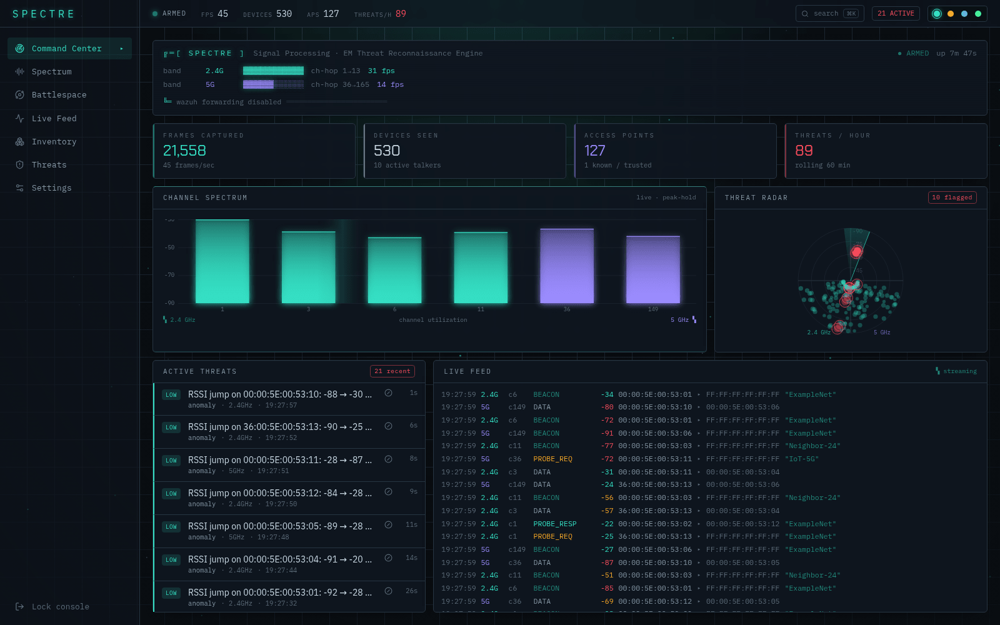
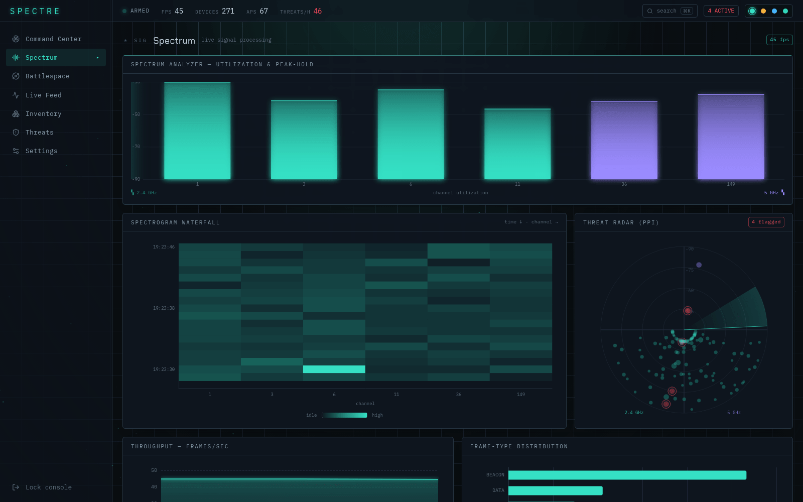
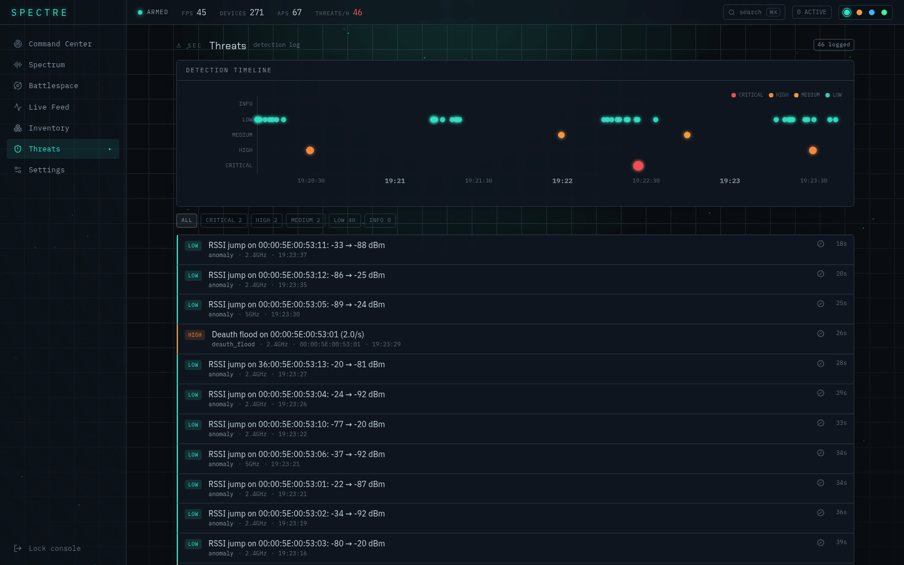
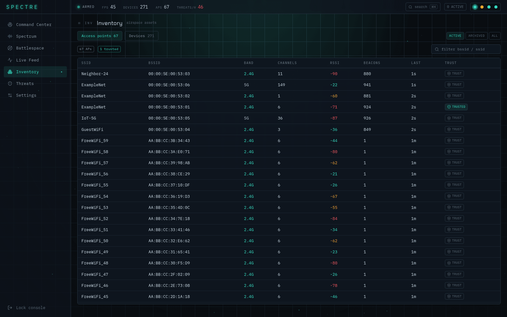
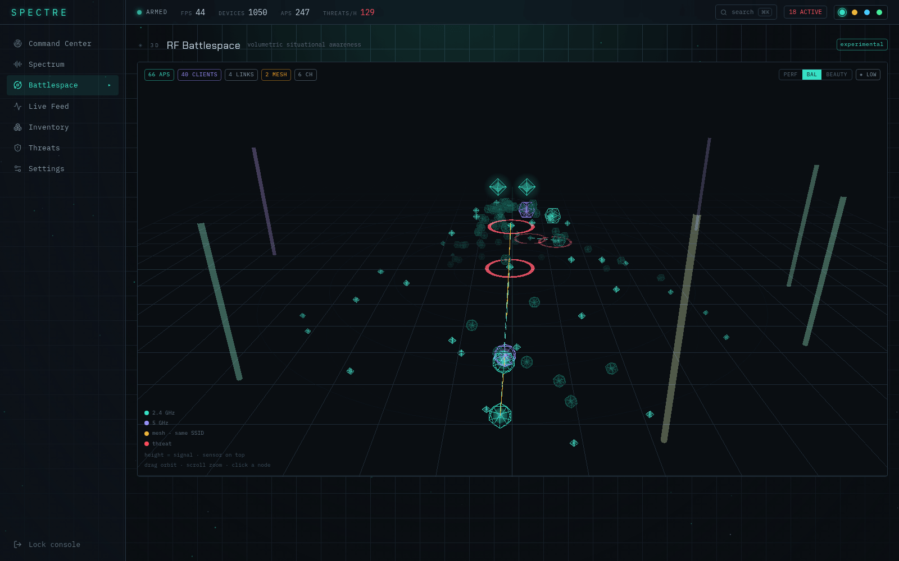
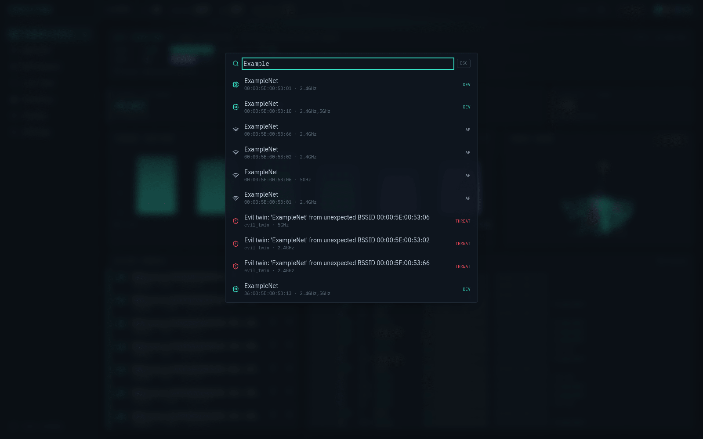
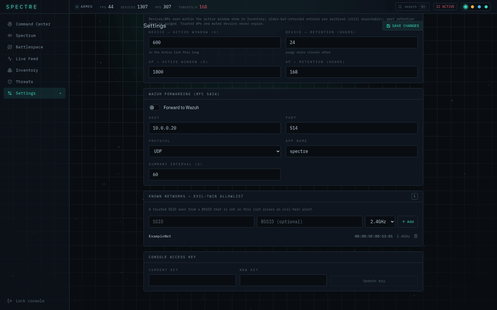
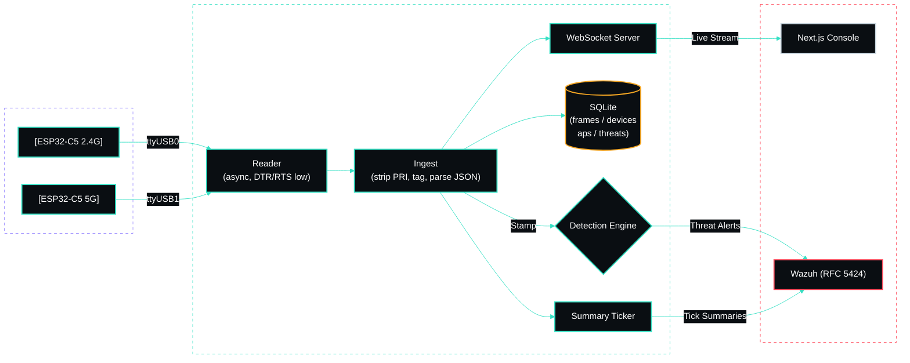
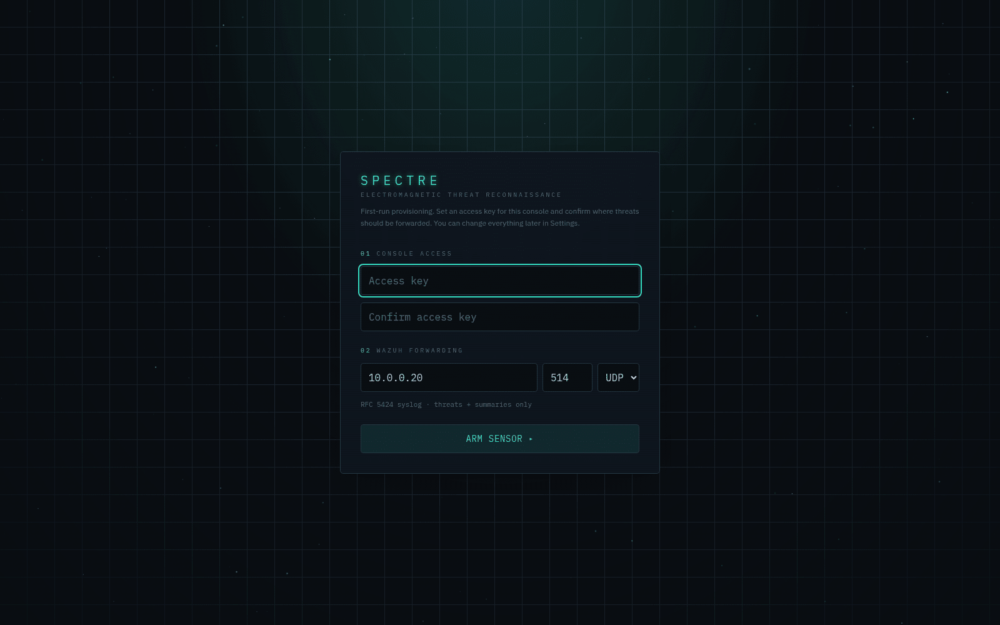

<br/>

<div align="center">


<br/>

**A wireless intrusion-detection sensor. Two radios watch the air. Nothing gets on quietly.**

<br/>

[](#-what-it-does)

<br/>

[](../../actions/workflows/ci.yml)
[](#)
[](LICENSE)
[](sensor/)
[](sensor/)
[](web/)
[](web/)
[](sensor/spectre/store.py)
[](docs/wazuh-integration.md)
[](docker-compose.yml)
[](CONTRIBUTING.md)

<br/>

<p>
  <a href="#-what-it-does"><b>What It Does</b></a> &nbsp;·&nbsp;
  <a href="#-the-console"><b>The Console</b></a> &nbsp;·&nbsp;
  <a href="#-features"><b>Features</b></a> &nbsp;·&nbsp;
  <a href="#-architecture"><b>Architecture</b></a> &nbsp;·&nbsp;
  <a href="#-data-contract"><b>Data Contract</b></a> &nbsp;·&nbsp;
  <a href="#-detection"><b>Detection</b></a> &nbsp;·&nbsp;
  <a href="#-quick-start"><b>Quick Start</b></a> &nbsp;·&nbsp;
  <a href="#-testing"><b>Testing</b></a> &nbsp;·&nbsp;
  <a href="#-deployment"><b>Deployment</b></a> &nbsp;·&nbsp;
  <a href="#-author"><b>Author</b></a>
</p>

</div>

---

## ✦ What It Does

**SPECTRE** turns two **ESP32-C5** WiFi boards — one sniffing 2.4GHz, one on 5GHz — into a live, dual-band **wireless intrusion-detection system**. Each board runs promiscuous-mode firmware that streams every management and data frame it hears as JSON over UART.

SPECTRE ingests both streams simultaneously, running attack-detection rules in real-time, rendering the threats in a beautiful, spectrum-analyzer–styled **SOC console**, and forwarding confirmed alerts to **Wazuh** as RFC 5424 syslog.

Built for seamless transitions, it can be developed and fully tested on a dev machine with the boards attached, then moved **unchanged** to a production LXC container on Proxmox.

```mermaid
%%{init: {
  'theme': 'base',
  'themeVariables': {
    'primaryColor': '#0a0e12',
    'primaryTextColor': '#fff',
    'primaryBorderColor': '#35E0C4',
    'lineColor': '#35E0C4',
    'secondaryColor': '#0a0e12',
    'tertiaryColor': '#0a0e12',
    'fontFamily': 'monospace'
  }
}}%%
flowchart LR
    A((("📡 The Air\n(2.4GHz + 5GHz)"))) -->|"802.11 frames"| B["ESP32-C5 ×2\n(Promiscuous)"]
    B -->|"JSON Stream"| C(["🔌 UART"])
    C -->|"Ingest"| D{"SPECTRE Sensor"}
    D -->|"WebSocket"| E["SOC Console"]
    D -->|"RFC 5424"| F["Wazuh SIEM"]

    style A fill:#0a0e12,stroke:#9B8CFF,stroke-dasharray: 5 5,stroke-width:2px
    style B fill:#0a0e12,stroke:#35E0C4,stroke-width:2px
    style C fill:#0a0e12,stroke:#35E0C4,stroke-width:2px
    style D fill:#0a0e12,stroke:#35E0C4,stroke-width:3px
    style E fill:#0a0e12,stroke:#C9D6DF,stroke-width:2px
    style F fill:#0a0e12,stroke:#FF4D5E,stroke-width:2px
```



> 💡 **Why it matters:** A single passive board hears ~30 frames/second in a normal home environment. SPECTRE keeps a rolling raw window for forensics, distills the rest into a complete device and AP inventory, and sends *only threats and periodic summaries* upstream. Your SIEM stays sharp instead of drowning in millions of frames per day.

---

## ✦ The Console

<div align="center">



<sub><b>Command Center</b> — dual-band sensor health, rolling counters, channel spectrum, threat radar, and the raw frame feed streaming over a WebSocket.</sub>

</div>

<br/>

<table>
<tr>
<td width="50%" valign="top">

<br/><sub><b>Spectrum</b> — channel-utilization analyzer with peak-hold, over a waterfall that adds one row per second.</sub>
</td>
<td width="50%" valign="top">

<br/><sub><b>Threats</b> — every detection with its rule, severity and evidence. All four rules firing here.</sub>
</td>
</tr>
<tr>
<td width="50%" valign="top">

<br/><sub><b>Inventory</b> — six real APs at the top (one <code>TRUSTED</code>), then 60 <code>FreeWiFi_*</code> BSSIDs that appeared in one second. That is a beacon flood, seen from the asset side.</sub>
</td>
<td width="50%" valign="top">

<br/><sub><b>Battlespace</b> — the RF environment in 3D. A deterministic layout from frame metadata, <b>not</b> triangulation.</sub>
</td>
</tr>
<tr>
<td width="50%" valign="top">

<br/><sub><b>⌘K</b> — global search across devices, APs and threats, backed by SQLite FTS5.</sub>
</td>
<td width="50%" valign="top">

<br/><sub><b>Settings</b> — live tuning, the Known Networks allowlist that evil-twin detection depends on, and four dark skins.</sub>
</td>
</tr>
</table>

> These screenshots are the **built-in simulator** (`SPECTRE_SOURCE=sim`), not a capture of a real
> network — the SSIDs and MAC addresses in them are documentation-range placeholders. Set that in
> your `.env` and run `docker compose up -d --build`, and you get exactly this. See
> [Running without hardware](#-testing).

---

## ✦ Features

- 🎯 **Dual-band sensing** — 2.4GHz + 5GHz boards, each **auto-identified from its boot event** (USB re-enumeration can't mix them up).
- ⚡ **Real-time detection** — Detects deauth/disassoc floods, rogue APs, evil twins, beacon & probe floods, new devices, and RSSI anomalies. All server-side, tunable in Settings without reflashing.
- 🎛️ **SOC threat console** — Live frame feed, complete device & AP inventory, threat log with a severity spine, channel-utilization spectrum sweeps, and throughput trends. Crafted with a dark RF-instrument aesthetic.
- 🛡️ **Wazuh forwarding** — Native RFC 5424 over UDP/TCP. Syslog severity intelligently mapped from threat severity. Sends only threats and summaries to preserve SIEM efficiency. Editable at runtime.
- 💾 **Smart retention** — Rolling raw-frame window (default 48h) + long-term aggregates. A proactive disk-usage guard prunes early before the partition fills.
- 🔐 **Secure & Local** — Single-password console with a first-run setup wizard. Config & session state stored safely in SQLite.
- 🧪 **Hardware-free testing** — A built-in simulator generates realistic traffic and injectable attack scenarios. A replay mode re-feeds a captured UART text file (one raw firmware line per line), paced by each frame's `uptime_ms`.

---

## ✦ Architecture

Two services configured elegantly via a single `docker-compose.yml`:

| Service | Stack | Port | Role |
|---|---|---|---|
| `sensor` | Python 3.11 · FastAPI · SQLite (stdlib core) | `8100` | UART ingest, detection, storage, Wazuh forwarding, API + WebSocket |
| `web` | Next.js 15 · Tailwind v4 · ECharts · three / react-three-fiber | `4100` | The SOC console |



> **Deep Dive:** Full component walk-through in **[docs/architecture.md](docs/architecture.md)**.

---

## ✦ Data Contract

Verified live from the hardware — each UART line follows this strict format:

```json
<190>ESP32C5 wifi_sniffer: {"seq":47,"uptime_ms":2728,"ch":6,"rssi":-55,
                            "type":"BEACON","src":"..","dst":"..","bssid":"..","ssid":"ExampleNet"}
```

- `<190>` is a firmware-prepended syslog PRI (which SPECTRE strips).
- The board sends no wall clock; **SPECTRE natively stamps arrival times.**
- The `seq` identifier resets on reboot.
- Band identification comes reliably from the `{"event":"boot","band":"2.4GHz"}` event line.

> **Deep Dive:** Full schema and volume notes in **[docs/data-contract.md](docs/data-contract.md)**.

---

## ✦ Detection Rules

**Four rules ship today**, each a module under [`sensor/spectre/detect/`](sensor/spectre/detect/):

| Rule ID | Signature Logic | Default Severity |
|:---|:---|:---:|
| `deauth_flood` | Spike in `DEAUTH` + `DISASSOC` frame rate per BSSID over a rolling window. | <kbd style="background:#FF4D5E;color:#000;">&nbsp;HIGH&nbsp;</kbd> |
| `evil_twin` | An **allowlisted** SSID broadcast from an un-allowlisted BSSID or the wrong band. Requires a Known Networks entry — without one it has no baseline and never fires. | <kbd style="background:#b91c1c;color:#fff;">&nbsp;CRITICAL&nbsp;</kbd> |
| `beacon_probe_flood` | Abnormal count of distinct beaconing BSSIDs, or heavy probe bursts. | <kbd style="background:#F5A623;color:#000;">&nbsp;MEDIUM&nbsp;</kbd> |
| `anomaly` | First-seen client MACs, or sharp RSSI delta jumps. Randomized-MAC alerts are **muted by default** — modern phones rotate MACs constantly and the signal is mostly noise. | <kbd style="background:#35E0C4;color:#000;">&nbsp;LOW&nbsp;</kbd> |

**All rules are fully tunable.** Windows, thresholds, and severities can be edited via the UI in **Settings**. Details and tuning guidance are in **[docs/detection-rules.md](docs/detection-rules.md)**.

---

## ✦ Quick Start

```bash
git clone https://github.com/gurvinny/spectre.git && cd spectre
bash init.sh                 # Generates .env + SPECTRE_SECRET, prompts for host IP
docker compose up -d --build
# Open http://<host>:4100  → Finish the setup wizard
```

<div align="center">

<br/><sub>First run: set the console password and point it at your SIEM.</sub>
</div>

### 🧪 No boards attached?
Run the integrated simulator instead. Set `SPECTRE_SOURCE=sim` in your `.env`, then run `docker compose up`. The console will fill with beautiful synthetic traffic and rotating attack scenarios.

---

## ✦ Configuration

Everything has a sensible default in `.env` (see `.env.example`) and can be changed at runtime from **Settings** (persisted in SQLite).

> ⚠️ **The `.env` values seed the database on first run only.** `Config._seed()` skips any key already present in the `config` table, so editing `.env` after the first boot has **no effect** on an existing install — the SQLite value wins. Change it in **Settings** (or `PUT /api/settings`), and check the live value with `GET /api/settings` rather than reading the file.

| Key | Default Value | Description |
|---|---|---|
| `SERIAL_PORTS` | `/dev/ttyUSB0,/dev/ttyUSB1` | Target boards (band is auto-detected). |
| `SPECTRE_SOURCE` | `serial` | Run mode: `serial` · `sim` · `replay`. |
| `WAZUH_HOST` / `WAZUH_PORT` | `10.0.0.20` / `514` | Target SIEM syslog destination. |
| `RAW_RETENTION_HOURS` | `48` | Window for rolling raw-frame retention. |
| `DISK_GUARD_PERCENT` | `85` | Early-prune threshold to prevent full disk. |

---

## ✦ Wazuh Integration

Threats and summaries are natively sent as **RFC 5424** (`app-name=spectre`). Syslog severity is automatically mapped from the threat severity level:
- `critical` → `crit`
- `high` → `alert`
- `medium` → `warning`
- `low` → `notice`
- `summary` → `info`

A sample decoder and ruleset to drop these perfectly into Wazuh live in **[docs/wazuh-integration.md](docs/wazuh-integration.md)**.

---

## ✦ Testing

The ingest, detection and storage core is **stdlib-only**, so the sensor suite runs with no
third-party test tooling and no hardware attached.

```bash
cd sensor && python -m unittest discover -s tests -p "test_*.py"   # 3 tests
cd web    && npm run test                                          # 24 checks
cd web    && npm run build                                         # production build
```

The web suite (`web/scripts/test.mjs`) bundles each `*.test.ts` with esbuild and runs it under
`node --test`; it covers the 3D battlespace layout, model, edge-flow and adaptive-quality logic.
Both suites run in CI on every push and pull request.

`npm run lint` is defined but **ESLint is not installed** in `web/` — `tsc --noEmit` is the
type-checking gate in practice.

### Running without hardware

Set `SPECTRE_SOURCE=sim` **in your `.env`** and bring the stack up:

```bash
docker compose up -d --build
```

> A shell prefix (`SPECTRE_SOURCE=sim docker compose up`) will **not** work — values from
> `env_file` are what reach the container, so the `.env` setting wins. Edit the file.
>
> `docker-compose.yml` also hard-declares both serial devices, and Docker errors on a missing
> device. With no boards attached, comment out the `devices:` block.

The simulator drives **both bands** and injects a rotating attack scenario every 45 seconds
(`deauth_flood` → `evil_twin` → `beacon_flood` → `probe_flood`), so every detection rule fires on
its own. It uses SSIDs `ExampleNet` / `Neighbor-24` / `GuestWiFi` / `IoT-5G` and MAC addresses from
the RFC 7042 documentation range `00:00:5E:00:53:xx`.

> Note: `evil_twin` only fires once the impersonated SSID is on the **Known Networks** allowlist —
> add `ExampleNet` in Settings, otherwise the rule has no baseline to compare against.

You can also drive the generator standalone:

```bash
python -m spectre.sim.generate --band 2.4GHz --scenario deauth_flood --duration 20
```

---

## ✦ API

All routes are under `/api` and require an authenticated session cookie, except `/health`,
`/api/status`, `/api/setup` and `/api/login`.

| Method | Route | Purpose |
|---|---|---|
| `GET` | `/health` | Liveness + version (unauthenticated) |
| `GET` | `/api/status` | Whether first-run setup is complete |
| `POST` | `/api/setup` · `/api/login` · `/api/logout` · `/api/password` | Session lifecycle |
| `GET` | `/api/overview` | Sensor liveness, counters, headline stats |
| `GET` | `/api/frames` | Rolling raw-frame window |
| `GET` | `/api/devices` · `/api/access-points` | Inventory (`?scope=active\|archived\|all`) |
| `GET` | `/api/threats` · `/api/summaries` · `/api/channels` | Detections, periodic rollups, channel use |
| `GET` | `/api/search?q=` | Global FTS5 search across devices, APs and threats |
| `GET` `PUT` | `/api/settings` | Live configuration |
| `GET` `POST` `DELETE` | `/api/known-networks` | Evil-twin allowlist |
| `GET` `POST` `DELETE` | `/api/muted-devices` | Per-MAC anomaly muting |
| `WS` | `/ws` | Live frame / threat / summary push |

---

## ✦ Deployment

Develop and test your configuration locally, then move the exact same compose configuration to your Proxmox LXC; **only `.env` needs to change.**

Unprivileged LXCs require the USB adapters to be passed through via `lxc.cgroup2.devices.allow` + `lxc.mount.entry`. The exact steps, alongside the host-reader fallback strategy, are fully documented in **[docs/deployment.md](docs/deployment.md)**.

---

## ✦ Troubleshooting

**No frames, and the console banner shows the sensor offline.** A board only counts as "detected"
once a reader has opened its port *and* a frame has arrived in the last 15 seconds — there is no
persisted device registry, so sensors disappear from the list after a restart until traffic
resumes. Check `docker compose logs sensor` for a failed open.

**Permission denied on `/dev/ttyUSB*`.** The container joins `dialout` via `group_add`; on the host
the invoking user needs to be in that group too, or the device node needs mode `0660` with a
`dialout` group.

**The board resets every time SPECTRE connects.** That is DTR/RTS asserting on open, which strap-
boots the ESP32. `reader.py` opens the port with both lines held low using a `termios` `TIOCMBIC`
ioctl — if you replace the reader, keep that behaviour.

**Unprivileged LXC: the device passes through as an empty file.** If `lxc.mount.entry` uses
`create=file` and the real device is absent when the container starts, you get a **regular
zero-byte file** at `/dev/ttyUSB1` instead of a character device. It is silent — Docker accepts the
path, the reader just fails to open it. Verify with `stat -c '%F' /dev/ttyUSB1`, which must print
`character special file`, not `regular empty file`.

**Wrong band on a sensor.** Band is latched from the `{"event":"boot","band":…}` line. On a
reconnect without a board reset that line is never seen, so the parser falls back to the channel
number (`ch >= 32` → 5GHz). Power-cycle the board to re-emit its boot event.

---

## ✦ Author

Built by **[gurvinny](https://github.com/gurvinny)**.

Licensed under the **GNU AGPL-3.0-or-later** — see [LICENSE](LICENSE). Copyright © 2026 gurvinny.
If you host a modified version, the AGPL requires you to publish your changes under the same open license.

**Commercial License:** To use SPECTRE in a closed-source or commercial product without the AGPL's source-disclosure obligations, a separate commercial license is available — reach out via [github.com/gurvinny](https://github.com/gurvinny).

<br/>

<div align="center">
  <sub>SPECTRE · Signal Processing &amp; Electromagnetic Threat Reconnaissance Engine</sub>
</div>
