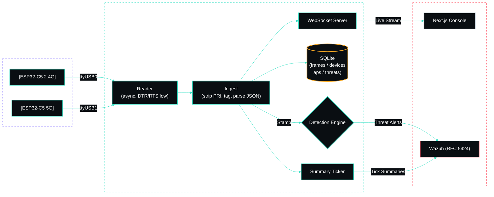

<br/>

<div align="center">


<br/>

**A wireless intrusion-detection sensor. Two radios watch the air. Nothing gets on quietly.**

<br/>

[](#-what-it-does)

<br/>

[](#)
[](LICENSE)
[](sensor/)
[](sensor/)
[](web/)
[](web/)
[](sensor/spectre/store.py)
[](docs/wazuh-integration.md)
[](docker-compose.yml)
[](CONTRIBUTING.md)

<br/>

<p>
  <a href="#-what-it-does"><b>What It Does</b></a> &nbsp;·&nbsp;
  <a href="#-features"><b>Features</b></a> &nbsp;·&nbsp;
  <a href="#-architecture"><b>Architecture</b></a> &nbsp;·&nbsp;
  <a href="#-data-contract"><b>Data Contract</b></a> &nbsp;·&nbsp;
  <a href="#-detection"><b>Detection</b></a> &nbsp;·&nbsp;
  <a href="#-quick-start"><b>Quick Start</b></a> &nbsp;·&nbsp;
  <a href="#-deployment"><b>Deployment</b></a> &nbsp;·&nbsp;
  <a href="#-author"><b>Author</b></a>
</p>

</div>

---

## ✦ What It Does

**SPECTRE** turns two **ESP32-C5** WiFi boards — one sniffing 2.4GHz, one on 5GHz — into a live, dual-band **wireless intrusion-detection system**. Each board runs promiscuous-mode firmware that streams every management and data frame it hears as JSON over UART.

SPECTRE ingests both streams simultaneously, running attack-detection rules in real-time, rendering the threats in a beautiful, spectrum-analyzer–styled **SOC console**, and forwarding confirmed alerts to **Wazuh** as RFC 5424 syslog.

Built for seamless transitions, it can be developed and fully tested on a dev machine with the boards attached, then moved **unchanged** to a production LXC container on Proxmox.


> 💡 **Why it matters:** A single passive board hears ~30 frames/second in a normal home environment. SPECTRE keeps a rolling raw window for forensics, distills the rest into a complete device and AP inventory, and sends *only threats and periodic summaries* upstream. Your SIEM stays sharp instead of drowning in millions of frames per day.

---

## ✦ Features

- 🎯 **Dual-band sensing** — 2.4GHz + 5GHz boards, each **auto-identified from its boot event** (USB re-enumeration can't mix them up).
- ⚡ **Real-time detection** — Detects deauth/disassoc floods, rogue APs, evil twins, beacon & probe floods, new devices, and RSSI anomalies. All server-side, tunable in Settings without reflashing.
- 🎛️ **SOC threat console** — Live frame feed, complete device & AP inventory, threat log with a severity spine, channel-utilization spectrum sweeps, and throughput trends. Crafted with a dark RF-instrument aesthetic.
- 🛡️ **Wazuh forwarding** — Native RFC 5424 over UDP/TCP. Syslog severity intelligently mapped from threat severity. Sends only threats and summaries to preserve SIEM efficiency. Editable at runtime.
- 💾 **Smart retention** — Rolling raw-frame window (default 48h) + long-term aggregates. A proactive disk-usage guard prunes early before the partition fills.
- 🔐 **Secure & Local** — Single-password console with a first-run setup wizard. Config & session state stored safely in SQLite.
- 🧪 **Hardware-free testing** — A built-in simulator generates realistic traffic and injectable attack scenarios. A replay mode allows playback of real `.pcap` / frame captures.

---

## ✦ Architecture

Two services configured elegantly via a single `docker-compose.yml`:

| Service | Stack | Port | Role |
|---|---|---|---|
| `sensor` | Python 3.11 · FastAPI · SQLite (stdlib core) | `8100` | UART ingest, detection, storage, Wazuh forwarding, API + WebSocket |
| `web` | Next.js 15 · Tailwind v4 · Recharts | `4100` | The Next.js SOC console |



> **Deep Dive:** Full component walk-through in **[docs/architecture.md](docs/architecture.md)**.

---

## ✦ Data Contract

Verified live from the hardware — each UART line follows this strict format:

```json
<190>ESP32C5 wifi_sniffer: {"seq":47,"uptime_ms":2728,"ch":6,"rssi":-55,
                            "type":"BEACON","src":"..","dst":"..","bssid":"..","ssid":"ExampleNet"}
```

- `<190>` is a firmware-prepended syslog PRI (which SPECTRE strips).
- The board sends no wall clock; **SPECTRE natively stamps arrival times.**
- The `seq` identifier resets on reboot.
- Band identification comes reliably from the `{"event":"boot","band":"2.4GHz"}` event line.

> **Deep Dive:** Full schema and volume notes in **[docs/data-contract.md](docs/data-contract.md)**.

---

## ✦ Detection Rules

| Rule Name | Signature Logic | Default Severity |
|:---|:---|:---:|
| **Deauth / Disassoc Flood** | Spike in `DEAUTH` + `DISASSOC` frame rate per BSSID over a rolling window. | <kbd style="background:#FF4D5E;color:#000;">&nbsp;HIGH&nbsp;</kbd> |
| **Rogue AP / Evil Twin** | Trusted SSID broadcasted from an un-allowlisted BSSID or wrong band. | <kbd style="background:#b91c1c;color:#fff;">&nbsp;CRITICAL&nbsp;</kbd> |
| **Beacon / Probe Flood** | Abnormal count of distinct beaconing BSSIDs or heavy probe bursts. | <kbd style="background:#F5A623;color:#000;">&nbsp;MEDIUM&nbsp;</kbd> |
| **New Device / RSSI Anomaly**| First-seen client MAC addresses or sharp RSSI delta jumps. | <kbd style="background:#35E0C4;color:#000;">&nbsp;LOW&nbsp;</kbd> |

**All rules are fully tunable.** Windows, thresholds, and severities can be edited via the UI in **Settings**. Details and tuning guidance are in **[docs/detection-rules.md](docs/detection-rules.md)**.

---

## ✦ Quick Start

```bash
git clone <your-remote> spectre && cd spectre
bash init.sh                 # Generates .env + SPECTRE_SECRET, prompts for host IP
docker compose up -d --build
# Open http://<host>:4100  → Finish the setup wizard
```

### 🧪 No boards attached?
Run the integrated simulator instead. Set `SPECTRE_SOURCE=sim` in your `.env`, then run `docker compose up`. The console will fill with beautiful synthetic traffic and rotating attack scenarios.

---

## ✦ Configuration

Everything has a sensible default in `.env` (see `.env.example`) and can be dynamically changed at runtime from **Settings** (persisted in SQLite).

| Key | Default Value | Description |
|---|---|---|
| `SERIAL_PORTS` | `/dev/ttyUSB0,/dev/ttyUSB1` | Target boards (band is auto-detected). |
| `SPECTRE_SOURCE` | `serial` | Run mode: `serial` · `sim` · `replay`. |
| `WAZUH_HOST` / `WAZUH_PORT` | `10.0.0.20` / `514` | Target SIEM syslog destination. |
| `RAW_RETENTION_HOURS` | `48` | Window for rolling raw-frame retention. |
| `DISK_GUARD_PERCENT` | `85` | Early-prune threshold to prevent full disk. |

---

## ✦ Wazuh Integration

Threats and summaries are natively sent as **RFC 5424** (`app-name=spectre`). Syslog severity is automatically mapped from the threat severity level:
- `critical` → `crit`
- `high` → `alert`
- `medium` → `warning`
- `low` → `notice`
- `summary` → `info`

A sample decoder and ruleset to drop these perfectly into Wazuh live in **[docs/wazuh-integration.md](docs/wazuh-integration.md)**.

---

## ✦ Deployment

Develop and test your configuration locally, then move the exact same compose configuration to your Proxmox LXC; **only `.env` needs to change.**

Unprivileged LXCs require the USB adapters to be passed through via `lxc.cgroup2.devices.allow` + `lxc.mount.entry`. The exact steps, alongside the host-reader fallback strategy, are fully documented in **[docs/deployment.md](docs/deployment.md)**.

---

## ✦ Author

Built by **[gurvinny](https://github.com/gurvinny)**.

Licensed under the **GNU AGPL-3.0-or-later** — see [LICENSE](LICENSE). Copyright © 2026 gurvinny.
If you host a modified version, the AGPL requires you to publish your changes under the same open license.

**Commercial License:** To use SPECTRE in a closed-source or commercial product without the AGPL's source-disclosure obligations, a separate commercial license is available — reach out via [github.com/gurvinny](https://github.com/gurvinny).

<br/>

<div align="center">
  <sub>SPECTRE · Signal Processing &amp; Electromagnetic Threat Reconnaissance Engine</sub>
</div>
